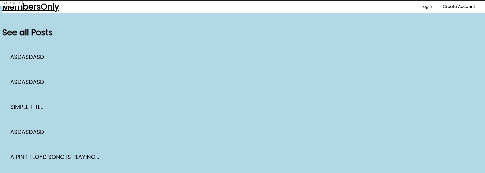
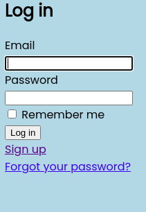
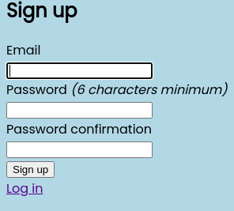

# MembersOnly

> A small app where Users can create posts. The authors of the posts are only visible for logged in users.

 

There can be many users. Users can create many posts.

## Built With

- Ruby 2.7.2
- Rails 6

<!-- ## Live Demo

[Live Demo Link](https://livedemo.com) -->

## Getting Started

To get a local copy up and running follow these simple example steps.

### Prerequisites

- `ruby 2.7.2 (rbenv preferred)`
- `bundle` gem installed
- `rails` gem installed
- `yarn` installed

### Setup

- clone the repo

### Install

- `cd` into the repo
- run `bundle install`
- run `yarn`
- run `rails db:migrate`
- run `rails server`

## Author

👤 **Josias Alvarado**

- GitHub: [@pointerish](https://github.com/pointerish)
- Twitter: [@pointerish](https://twitter.com/pointerish)
- LinkedIn: [LinkedIn](https://www.linkedin.com/in/josias-alvarado/)

## 🤝 Contributing

Contributions, issues, and feature requests are welcome!

Feel free to check the [issues page](https://github.com/pointerish/members-only/issues).

## Show your support

Give a ⭐️ if you like this project!

## Acknowledgments

- Odin Project
- Microverse

## 📝 License

This project is [MIT](lic.url) licensed.
